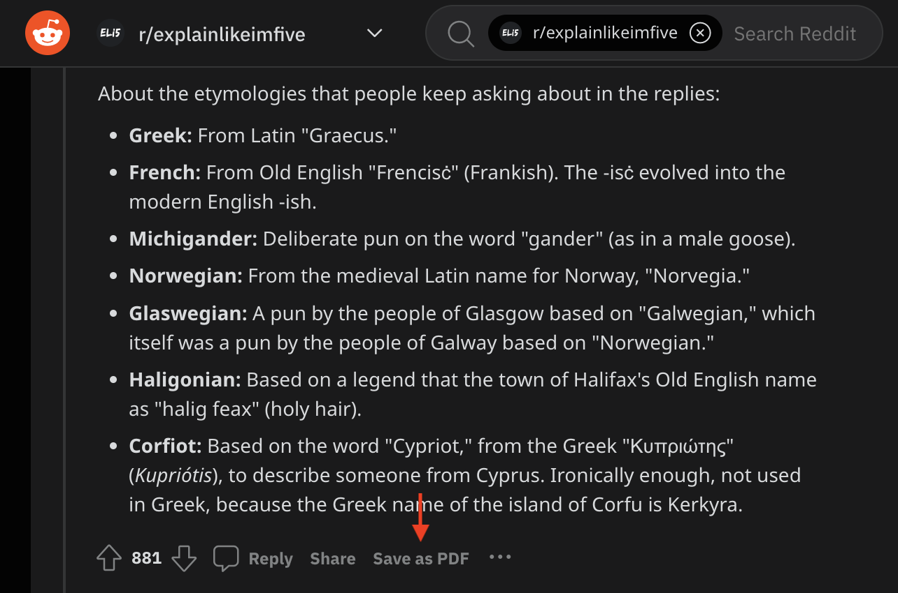

# Reddit - Save as PDF (alpha)

A chrome extension to save a Reddit comment as PDF.

Because occasionally I want to do so.

### Requirements
- Works with the new Reddit UI, not old.
- Bundles [html2pdf](https://github.com/eKoopmans/html2pdf.js) v0.9.3, since Chrome Manifest v3 [no longer allows](https://developer.chrome.com/docs/extensions/migrating/improve-security/#remove-remote-code) executing remotely hosted files directly.

### Installation

Installation is currently manual as this is an unpublished extension.

1. Clone this repo
1. Go to: [chrome://extensions](chrome://extensions)
1. Enable **Developer mode**
1. Load unpacked, select this directory
1. Enable the extension

Probably disable it after trying out for now :D

### TODO
- [jsPDF](https://github.com/parallax/jsPDF) issues
  - Doesn't fix CSP error on extension page (triggered only when logged in and hit the Save as PDF button, even though functionality still works)
  - Takes a much longer time to save
  - Link is cut off
  - Formatting could still be better
  - Can highlight text but it's per word
- Simplify DOM traversal

#### Nice to haves
- Use bg worker to open up embed page and save nicer version?
- Add Save to PDF button elsewhere too (main post, from homepage, etc)
